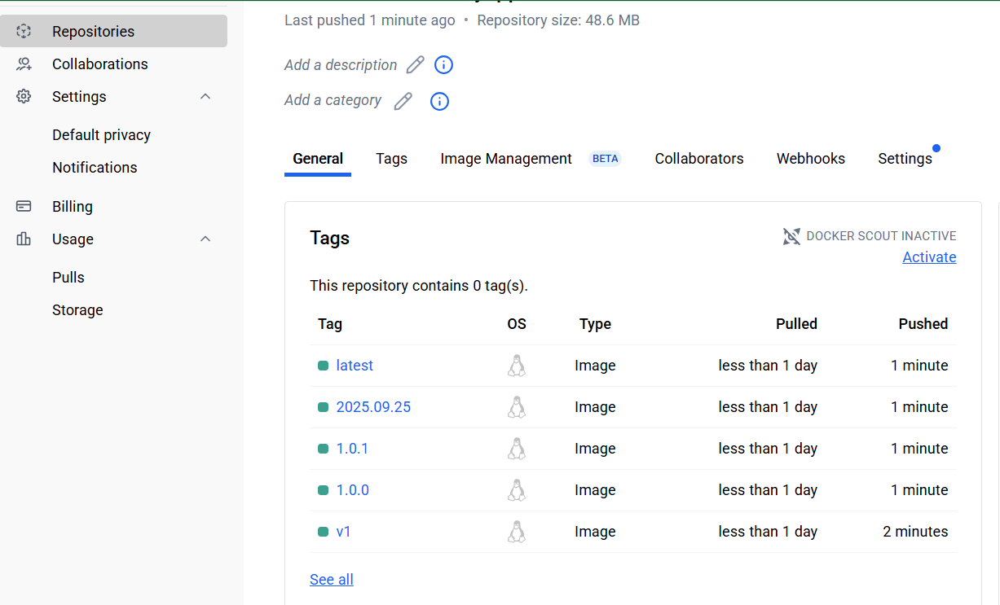

# Lab 24: Docker Tagging and Versioning

## Objectives
- Understand the importance of tagging and versioning in Docker.
- Learn how to build Docker images with custom tags.
- Push Docker images to a Docker registry.
- Explore best practices in Docker image naming conventions and version management.

## Tasks & Steps

### Task 1: Build an Image with a Custom Tag
1. Created project directory and added files (`Dockerfile`, `requirements.txt`, `app.py`).
2. Built Docker image with a custom tag:
   ```bash
   docker build -t myapp:v1 .
   ```

### Task 2: Push the Image to Docker Hub
1. Logged into Docker Hub using a Personal Access Token (PAT):
   ```bash
   docker login
   ```
2. Tagged the image for Docker Hub:
   ```bash
   docker tag myapp:v1 haroonurrasheed/myapp:v1
   ```
3. Pushed the image:
   ```bash
   docker push haroonurrasheed/myapp:v1
   ```

### Task 3: Naming Conventions and Version Management
- Tagged semantic versions:
  ```bash
  docker tag myapp:v1 haroonurrasheed/myapp:1.0.0
  docker tag myapp:v1 haroonurrasheed/myapp:1.0.1
  ```
- Tagged date-based version:
  ```bash
  docker tag myapp:v1 haroonurrasheed/myapp:2025.09.25
  ```
- Tagged latest:
  ```bash
  docker tag myapp:v1 haroonurrasheed/myapp:latest
  ```
- Pushed all tags to Docker Hub.

## Verification
Docker Hub repository shows all tags (`v1`, `1.0.0`, `1.0.1`, `2025.09.25`, `latest`) pushed successfully.



## Conclusion
By following this lab, we successfully built a Docker image, applied semantic and date-based versioning, and pushed multiple tags to Docker Hub. This demonstrates the best practices in Docker image management, ensuring reproducibility, version tracking, and consistency in deployments.
