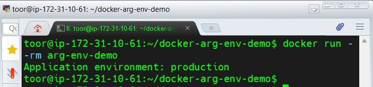

# Lab 27 – Dockerfile ARG vs. ENV

## Objectives
- Understand the differences between `ARG` and `ENV` in Dockerfiles.
- Learn how to use `ARG` for build-time parameters.
- Learn how to use `ENV` for runtime environment variables.
- Explore scenarios where each variable type is useful.

## What We Did
1. Created a `Dockerfile` with both `ARG` and `ENV` instructions.
2. Created a simple Python application (`app.py`) to demonstrate reading runtime ENV variables.
3. Built the Docker image using a build-time argument (`APP_VERSION=2.0.0`).
4. Ran the container and observed the runtime environment variable `APP_ENV`.

## Key Takeaways
- **ARG** is only available during build time, and cannot be accessed once the image is built.
- **ENV** persists into runtime and is suitable for configuration values that change per environment (dev, staging, prod).
- Combining `ARG` for build-time and `ENV` for runtime ensures flexibility and separation of concerns.

## Screenshot
Below is the screenshot showing successful container execution with ENV:

